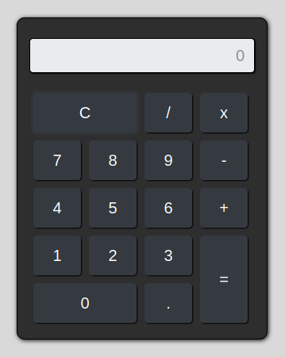
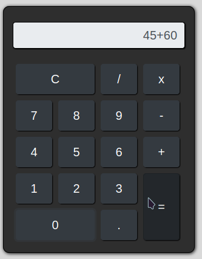
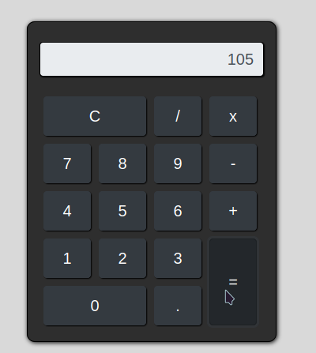
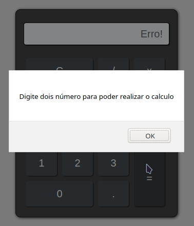

# Projeto_App-Calculadora
**Atenção!** 
Esse projeto é basico feito apenas para praticar os conhecimentos sobre *JavaScript*

>Desenvolvido no curso de desenvolvimento web 
**Pelo professor:** _Jorge Sant ana_
**Melhorado por mim:** _Vando Dos Reis_

#### Tecnologias Usadas
> JavaScript.
Html.
Css.
Bootstrap 4.

#### imagens da calculadora

Ao iniciar a aplicação já aparecera a calculadora.

Aqui é mostrado o calculo, só é permitido fazer apenas uma operação por vez.

Aqui é mostrado o resultado após o usuario clicar no borão de igual.

Caso o usuario não informe nenhum número e tente realizar algum calculo, apresentara erro na tela junto com um dailog informando ao usuario o que ele deve fazer.

